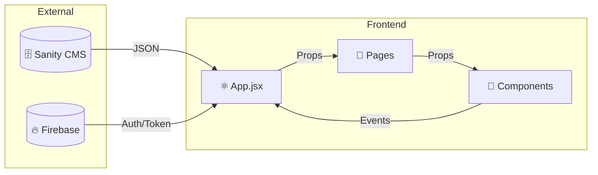

# 📘 THE TALK - Documentação Completa

> [!NOTE]
> **Versão:** 1.10.4 | **Última Atualização:** 12 de Janeiro de 2026

| 🔗 Links Rápidos | |
|------------------|--|
| **Repositório** | [github.com/sammagbo/the-talk](https://github.com/sammagbo/the-talk) |
| **Deploy** | [the-talk-podcast.vercel.app](https://the-talk-podcast.vercel.app) |

---

## 📋 Índice

1. [Visão Geral](#1-visão-geral)
2. [Stack Tecnológico](#2-stack-tecnológico)
3. [Estrutura do Projeto](#3-estrutura-do-projeto)
4. [Configuração e Instalação](#4-configuração-e-instalação)
5. [Arquitetura](#5-arquitetura)
6. [Páginas](#6-páginas)
7. [Componentes](#7-componentes)
8. [Hooks e Context](#8-hooks-e-context)
9. [Integrações](#9-integrações)
10. [Internacionalização](#10-internacionalização)
11. [PWA e Performance](#11-pwa-e-performance)
12. [SEO e Acessibilidade](#12-seo-e-acessibilidade)
13. [Testes](#13-testes)
14. [Deploy](#14-deploy)
15. [Changelog](#15-changelog)

---

## 1. Visão Geral

**THE TALK** é um website de podcast focado em moda e lifestyle, apresentado por **Mijean Rochus**. O site combina design "High Fashion" com tecnologia moderna.

### ✨ Principais Funcionalidades

| Feature | Descrição |
|---------|-----------|
| 🎧 **Player Híbrido** | Áudio integrado com Spotify e vídeo do YouTube |
| 📺 **Vídeo First** | Carrossel de vídeos no Hero + Shorts verticais |
| 📝 **Blog Rico** | Artigos com formatação avançada via Portable Text |
| 🛒 **Boutique** | Loja de produtos integrada com Stripe |
| 👤 **Comunidade** | Sistema de autenticação, favoritos e comentários |
| 🔔 **Engajamento** | Notificações push via Firebase Cloud Messaging |
| 🌐 **Global** | Suporte completo a 4 idiomas (FR, EN, PT, ES) |

---

## 2. Stack Tecnológico

### 🎨 Frontend

| Tecnologia | Versão | Uso |
|------------|--------|-----|
| **React** | 18.3.1 | UI Framework |
| **React Router** | 7.10.1 | Roteamento SPA |
| **Vite** | 7.2.4 | Build tool ultra-rápido |
| **TailwindCSS** | 3.4.18 | Styling utility-first |
| **Lucide React** | 0.555.0 | Ícones vetoriais leves |
| **GSAP** | 3.x | Animações profissionais |

### 🛠️ Backend & Serviços

| Serviço | Propósito |
|---------|-----------|
| **Sanity.io** | Headless CMS para gerenciamento de conteúdo (Episódios, Blog, Produtos) |
| **Firebase** | Autenticação (Auth) e Push Notifications (Cloud Messaging) |
| **Vercel** | Hospedagem, CI/CD e Serverless Functions |
| **Stripe** | Processamento de pagamentos seguro |
| **Sentry** | Monitoramento de erros e performance em tempo real |

### 🧪 DevDependencies

| Ferramenta | Uso |
|------------|-----|
| **Vitest** | Unit testing |
| **Cypress** | E2E testing |
| **ESLint** | Linting |
| **vite-plugin-pwa** | Service Worker & PWA |

---

## 3. Estrutura do Projeto

```tree
the-talk/
├── public/                 # Assets estáticos globais
│   ├── videos/             # 🎥 Vídeos do carrossel (Carrousel.mp4)
│   ├── favicon.png
│   └── logo.png
├── src/
│   ├── assets/             # Imagens e fontes locais
│   ├── components/         # 🧩 19 Componentes reutilizáveis
│   ├── context/            # 🔄 Estado global (AuthContext)
│   ├── hooks/              # 🪝 Custom hooks (usePushNotifications)
│   ├── lib/                # Configurações de libs (Stripe)
│   ├── locales/            # 🌍 Arquivos de tradução i18n (4 idiomas)
│   ├── pages/              # 📄 7 Páginas da aplicação
│   ├── utils/              # Funções utilitárias
│   ├── App.jsx             # Componente Raiz
│   ├── main.jsx            # Entry point
│   ├── firebase.js         # Firebase config
│   ├── sanity.js           # Sanity client
│   └── i18n.js             # i18n config
├── studio/                 # 🏗️ Sanity Studio (CMS Config)
├── cypress/                # 🧪 Testes E2E
├── index.html              # Static fallback + SEO
├── vite.config.js          # Build config
└── package.json
```

---

## 4. Configuração e Instalação

### ⚠️ Pré-requisitos

- Node.js 18+
- npm ou yarn
- Conta Sanity.io
- Projeto Firebase

### 🔑 Variáveis de Ambiente

Crie um arquivo `.env` na raiz:

```env
# Sanity
VITE_SANITY_PROJECT_ID=your_project_id
VITE_SANITY_DATASET=production
VITE_SANITY_API_VERSION=2024-01-01

# Firebase
VITE_FIREBASE_API_KEY=your_api_key
VITE_FIREBASE_AUTH_DOMAIN=your_domain
VITE_FIREBASE_PROJECT_ID=your_project
VITE_FIREBASE_MESSAGING_SENDER_ID=your_sender_id
VITE_FIREBASE_APP_ID=your_app_id
VITE_FIREBASE_VAPID_KEY=your_vapid_key

# Stripe (Pagamentos)
# Obtenha em: https://dashboard.stripe.com/apikeys
VITE_STRIPE_KEY=pk_test_your_publishable_key
```

### 🚀 Instalação & Execução

```bash
# 1. Clone o repositório
git clone https://github.com/sammagbo/the-talk.git
cd the-talk

# 2. Instale dependências
npm install

# 3. Inicie o servidor local
npm run dev
# Acessível em: http://localhost:5173
```

> [!TIP]
> Para acessar o CMS localmente, entre na pasta `studio` e rode `npm run dev`.

### 📜 Scripts Disponíveis

| Comando | Descrição |
|---------|-----------|
| `npm run dev` | Servidor de desenvolvimento |
| `npm run build` | Build de produção |
| `npm run preview` | Preview do build |
| `npm run lint` | Verificar linting |
| `npm run test` | Executar testes unitários |

---

## 5. Arquitetura

### 🔄 Fluxo de Dados



### 🗺️ Roteamento Principal

| Rota | Página | Descrição |
|------|--------|-----------|
| `/` | **Home** | Landing page com carrossel e destaques |
| `/episode/:id` | **EpisodePage** | Player de mídia e detalhes |
| `/blog` | **BlogPage** | Listagem de artigos |
| `/blog/:slug` | **BlogPost** | Artigo individual |
| `/store` | **StorePage** | Loja de produtos |
| `/profile` | **ProfilePage** | Área do usuário |
| `/admin` | **AdminPage** | Dashboard de administração |

### 📦 Bundle Splitting

| Chunk | Conteúdo | Tamanho |
|-------|----------|---------|
| `vendor-react` | React, Router | ~56 KB |
| `vendor-firebase` | Firebase SDK | ~104 KB |
| `vendor-sanity` | Sanity Client | ~30 KB |
| `vendor-i18n` | i18next | ~18 KB |
| `index` | App code | ~22 KB |

---

## 6. Páginas

### 6.1 🏠 Home.jsx

**Rota:** `/`

> [!NOTE]
> Esta é a página principal e mais complexa do site.

**Seções:**
- Hero com Video Carousel e CTAs
- Quick Stats (Épisodes, Auditeurs, Rating)
- Featured Episode
- Continue Listening
- Shorts Section
- Vidéos Section (Carrossel horizontal)
- Épisodes Audio Section
- Blog Preview
- About Section (Biografia de Mijean)
- Contact Form
- Boutique Preview

---

### 6.2 � EpisodePage.jsx

**Rota:** `/episode/:id`

**Features:**
- 🎬 Toggle Watch/Listen (Vídeo vs Áudio)
- 🎵 Embed Spotify para áudio
- 📺 Embed YouTube para vídeo
- 💬 Seção de comentários
- ⭐ Rating system (5 estrelas)
- 🏆 Badges display
- 🔗 Share buttons
- 📋 Episódios relacionados

---

### 6.3 📝 BlogPage.jsx & BlogPost.jsx

**Rotas:** `/blog` e `/blog/:slug`

**Features:**
- Lista de posts do Sanity
- LazyImage para thumbnails
- Formatação de datas localizada
- Portable Text rendering
- SEO meta tags dinâmicas

---

### 6.4 🛒 StorePage.jsx

**Rota:** `/store`

**Features:**
- Lista de produtos do Sanity
- Integração Stripe Checkout
- Estados de loading e vazio

---

### 6.5 👤 ProfilePage.jsx

**Rota:** `/profile`

**Features:**
- Dados do usuário
- Histórico de escuta
- Favoritos
- Badges conquistados
- Configurações de privacidade

---

### 6.6 ⚙️ AdminPage.jsx

**Rota:** `/admin`

> [!WARNING]
> Esta página requer autenticação de administrador.

**Features:**
- Dashboard de analytics
- Gerenciamento de conteúdo
- Moderação de comentários
- Envio de notificações push

---

## 7. Componentes

### 🧭 Navegação

| Componente | Descrição |
|------------|-----------|
| `Navbar.jsx` | Menu principal com navegação responsiva e full-screen |
| `LanguageSwitcher.jsx` | Seletor de idioma (4 idiomas) |
| `ThemeToggle.jsx` | Toggle dark/light mode |

### 🎵 Player & Mídia

| Componente | Descrição |
|------------|-----------|
| `Player.jsx` | Player de áudio fixo no footer |
| `LazySpotifyEmbed.jsx` | Embed Spotify com lazy loading |
| `ContinueListening.jsx` | Seção "Continue ouvindo" |
| `LazyImage.jsx` | Imagens com srcset e lazy loading |

### 💬 Interação

| Componente | Descrição |
|------------|-----------|
| `CommentsSection.jsx` | Sistema de comentários |
| `Rating.jsx` | Sistema de avaliação 5 estrelas |
| `PollComponent.jsx` | Enquetes interativas |
| `BadgesDisplay.jsx` | Exibição de badges/conquistas |

### 🎨 UI Elements

| Componente | Descrição |
|------------|-----------|
| `Toast.jsx` | Notificações toast |
| `SubscribeModal.jsx` | Modal de newsletter |
| `ExitIntentPopup.jsx` | Popup de saída |
| `SponsorBanner.jsx` | Banner de patrocinadores |
| `OfflineAlert.jsx` | Alerta de modo offline |
| `ErrorBoundary.jsx` | Tratamento de erros com UI amigável |
| `Skeleton.jsx` | 8 variantes de skeleton loaders |
| `EmptyState.jsx` | 8 variantes de estados vazios |

### 🎬 Animações GSAP

| Componente | Descrição |
|------------|-----------|
| `CustomCursor.jsx` | Cursor animado (anel + ponto) com hover effects |
| `MagneticButton.jsx` | Botões com efeito magnético (puxam ao cursor) |
| `LoadingScreen.jsx` | Tela de loading com logo reveal e progress bar |

---

## 8. Hooks e Context

### 🔐 AuthContext

```jsx
const { user, login, logout, loading } = useAuth();
```

**Funcionalidades:**
- Login com Firebase Auth (Google)
- Estado de autenticação persistente
- Dados do usuário sincronizados

### 🔔 usePushNotifications

```jsx
const { 
  permission, 
  requestPermission, 
  isSubscribed 
} = usePushNotifications();
```

**Funcionalidades:**
- Gerenciamento de permissões
- FCM token management
- Subscribe/unsubscribe

### 🎬 useGSAP

```jsx
import { useGSAP, gsap, ScrollTrigger } from '../hooks/useGSAP';

useGSAP(() => {
    gsap.from('.element', { y: 50, opacity: 0, duration: 1 });
}, []);
```

**Funcionalidades:**
- Hook para integrar GSAP com React
- Cleanup automático de animações
- ScrollTrigger já registrado
- Funções utilitárias: `fadeInUp`, `fadeInScale`, `scrollAnimation`, `parallax`

---

## 9. Integrações

### �️ Sanity CMS

**Schemas disponíveis:**

| Schema | Campos principais |
|--------|-------------------|
| `episode` | title, slug, description, image, audioUrl, spotifyUrl, videoUrl, duration |
| `post` | title, slug, mainImage, excerpt, body (Portable Text), publishedAt |
| `product` | title, price, image, description, stripePriceId |
| `short` | title, videoUrl, thumbnail, publishedAt |

**Client:**
```javascript
// src/sanity.js
import { createClient } from '@sanity/client';
import imageUrlBuilder from '@sanity/image-url';

export const client = createClient({
  projectId: import.meta.env.VITE_SANITY_PROJECT_ID,
  dataset: import.meta.env.VITE_SANITY_DATASET,
  apiVersion: import.meta.env.VITE_SANITY_API_VERSION,
  useCdn: true
});

export const urlFor = (source) => imageUrlBuilder(client).image(source);
```

### 🔥 Firebase

**Serviços utilizados:**
- **Auth** - Autenticação de usuários (Google Sign-In)
- **Cloud Messaging** - Push notifications

---

## 10. Internacionalização

### 🌍 Idiomas Suportados

| Código | Idioma | Status |
|--------|--------|--------|
| `fr` | Français | ✅ Default |
| `en` | English | ✅ Completo |
| `pt` | Português | ✅ Completo |
| `es` | Español | ✅ Completo |

### 📁 Estrutura de Arquivos

```
src/locales/
├── fr.json    # ~200 chaves
├── en.json
├── pt.json
└── es.json
```

### 💻 Uso no Código

```jsx
import { useTranslation } from 'react-i18next';

const { t, i18n } = useTranslation();

// Traduzir texto
<h1>{t('hero.title')}</h1>

// Mudar idioma
i18n.changeLanguage('pt');
```

---

## 11. PWA & Performance

### ⚡ Estratégias de Otimização

| Otimização | Implementação |
|------------|---------------|
| **Bundle Splitting** | `manualChunks` no Vite config |
| **Lazy Loading** | `React.lazy()` para páginas |
| **Image Optimization** | `srcset` + WebP via LazyImage |
| **Preconnect** | DNS prefetch para CDNs |
| **Preload** | LCP image preload |

> [!IMPORTANT]
> O bundle size foi reduzido em **73%** na versão 1.10.2 removendo dependências pesadas de IA client-side (WebLLM).

### 📊 Métricas Target (Core Web Vitals)

| Métrica | Target | Status |
|---------|--------|--------|
| **LCP** | < 2.5s | ✅ |
| **FID** | < 100ms | ✅ |
| **CLS** | < 0.1 | ✅ |
| **TTI** | < 3s (3G) | ✅ |

### 📱 PWA Features

- Service Worker com precaching
- Offline support
- Instalável como app nativo
- Background sync

---

## 12. SEO & Acessibilidade

### 🔍 Meta Tags

```jsx
<Helmet>
  <title>THE TALK | Podcast by Mijean Rochus</title>
  <meta name="description" content="..." />
  <meta property="og:title" content="..." />
  <meta property="og:image" content="..." />
  <meta name="twitter:card" content="summary_large_image" />
</Helmet>
```

### 📊 JSON-LD Structured Data

| Schema | Página |
|--------|--------|
| `PodcastSeries` | Home |
| `PodcastEpisode` | EpisodePage |
| `WebSite` | index.html |
| `Organization` | index.html |

### ♿ Acessibilidade

- ⏭️ Skip Link para navegação por teclado
- 🏷️ Aria labels em todos os elementos interativos
- 🎹 Navegação completa por teclado
- 🎨 Contraste de cores em conformidade

---

## 13. Testes

### 🧪 Unit Tests (Vitest)

```bash
npm run test
```

**Cobertura:**
- Componentes
- Hooks
- Utils

### 🌐 E2E Tests (Cypress)

```bash
npx cypress open
```

**Cenários:**
- Navegação entre páginas
- Player de áudio
- Formulários
- Autenticação

---

## 14. Deploy

### ▲ Vercel

**Configuração automática:**

| Campo | Valor |
|-------|-------|
| Build Command | `npm run build` |
| Output Directory | `dist` |
| Framework | Vite |

### 🔑 Variáveis de Ambiente

Configurar no dashboard do Vercel todas as variáveis do `.env`.

### 🌐 Domínios

| Ambiente | URL |
|----------|-----|
| **Produção** | `the-talk-podcast.vercel.app` |
| **Preview** | `the-talk-*.vercel.app` |

---

## 15. Changelog

### 🎬 v1.10.4 (12/01/2026) - GSAP Animations

> [!TIP]
> Esta versão adiciona animações profissionais de "High Fashion" usando GSAP.

**Novos Componentes:**
- 🎯 **CustomCursor**: Cursor animado com anel + ponto que segue o mouse
- 🧲 **MagneticButton**: Botões que puxam em direção ao cursor
- 🎬 **LoadingScreen**: Tela de loading com logo reveal + progress bar

**Animações:**
- ✨ **Hero Timeline**: Animações sequenciais no título, subtítulo, CTAs e stats
- 📜 **Scroll Trigger**: Seções aparecem suavemente ao entrar na viewport
- 🏔️ **Parallax**: Efeito parallax no vídeo do About section

---

### 🎬 v1.10.3 (12/01/2026) - Carousel Cross-fade

> [!TIP]
> Esta versão melhora significativamente a experiência visual do Hero.

- ✅ **Smooth Transition**: Implementado cross-fade no carrossel do Hero, eliminando o "gap" preto entre vídeos
- ✨ **Visual Polish**: Ajustes finos de animação
- 📄 **Documentation**: DOCUMENTATION.md atualizado com formatação rica

---

### 🚀 v1.10.2 (12/01/2026) - Performance, SEO & UX Audit

**🚀 Performance (73% Bundle Reduction)**
- 🗑️ **AI Removed**: Removido AIAssistant, useWebLLM hook e @mlc-ai/web-llm (5.5MB → 0)
- ⚡ **Build Time**: Reduzido de 24s para 10s
- 📦 **Bundle Size**: De 14.7MB para 4MB

**♿ Acessibilidade**
- ⏭️ **Skip Link**: Link "Passer au contenu principal"
- 🏷️ **Aria Labels**: Adicionados em botões de navegação
- 🎹 **Keyboard Navigation**: Suporte completo

**🔍 SEO**
- 📊 **Schema.org**: PodcastSeries e PodcastEpisode com JSON-LD
- 🗺️ **Sitemap Automático**: vite-plugin-sitemap gera sitemap.xml

**🎨 UX & Design**
- 💀 **Skeleton Loaders**: 8 componentes
- 📭 **Empty States**: 8 estados amigáveis
- 🚨 **Error Boundary**: UI moderna

---

### 🎯 v1.10.1 (12/01/2026) - Navegação e UX Fixes

- ✅ **Navbar Home**: Scroll suave para o topo
- ✅ **Video Navigation**: Força modo "Assistir" 
- 🎥 **Hero Video**: Vídeo local `Carrousel.mp4`
- ▶️ **Shorts Auto-Play**: Auto-play e auto-advance
- 🎬 **Video Carousel**: Carrossel horizontal

---

### 📱 v1.9.x - Internationalization

- ✅ **ProfilePage i18n**: Tradução completa
- ✅ **Hero Section**: Traduzido
- ✅ **BlogPage**: Full i18n
- ✅ **Date Localization**: Formatação por idioma

---

### 🛒 v1.6.x - Shorts & Store

- ✅ **Shorts Section**: Vídeos verticais 9:16
- ✅ **Product Schema**: Novo schema no Sanity
- ✅ **Stripe Integration**: Checkout funcional

---

### 🎨 v1.1.0-v1.4.x - Design Evolution

- ✅ **DICH Fashion**: HUD Data Badges
- ✅ **EMMPO**: Bracket CTAs, Film Grain
- ✅ **VOGUE**: Hybrid Typography
- ✅ **Video Carousel**: Hero com vídeos

---

## 📞 Suporte

Para dúvidas técnicas ou comerciais:

| Canal | Contato |
|-------|---------|
| 📧 Email | sammagbo@gmail.com |
| 📸 Instagram | [@the_talk_audiovideopodcast](https://instagram.com/the_talk_audiovideopodcast) |

---

> Documentação gerada por **Sammy Magbo** 🚀
