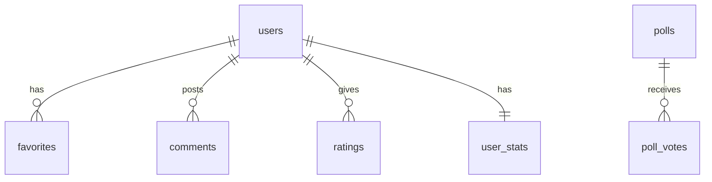

# THE TALK Podcast

<div align="center">


**🎙️ A Fashion & Culture Podcast by Mijean Rochus**

[](https://the-talk-podcast.vercel.app)
[](https://supabase.com)
[](https://react.dev)
[](https://vite.dev)

</div>

---

## ✨ Features

- 🎧 **Podcast Player** - Stream episodes with Spotify integration
- ❤️ **Favorites** - Like and save episodes
- 💬 **Comments** - Real-time discussions on episodes
- ⭐ **Ratings** - 5-star rating system
- 🏆 **Gamification** - Badges and achievements
- 🌍 **i18n** - Multi-language support (FR, EN, PT)
- 📱 **PWA** - Install as mobile app
- 🌙 **Dark Mode** - Beautiful dark theme

---

## 🛠️ Tech Stack

| Layer | Technology |
|-------|------------|
| **Frontend** | React 18, Vite 7, GSAP |
| **Backend** | Supabase (PostgreSQL + Auth) |
| **CMS** | Sanity.io |
| **Styling** | TailwindCSS, Lucide Icons |
| **Hosting** | Vercel |

---

## 🚀 Quick Start

### Prerequisites
- Node.js 18+
- npm or yarn
- Supabase account
- Sanity account

### Installation

```bash
# Clone repository
git clone https://github.com/sammagbo/the-talk.git
cd the-talk

# Install dependencies
npm install

# Copy environment template
cp .env.example .env

# Start development server
npm run dev
```

### Environment Variables

Create a `.env` file with:

```env
# Supabase
VITE_SUPABASE_URL=https://your-project.supabase.co
VITE_SUPABASE_ANON_KEY=your-anon-key

# Sanity
VITE_SANITY_PROJECT_ID=your-project-id
VITE_SANITY_DATASET=production
```

---

## 📁 Project Structure

```
the-talk/
├── src/
│   ├── components/      # React components
│   ├── context/         # Auth context
│   ├── hooks/          # Custom hooks
│   ├── pages/          # Page components
│   ├── utils/          # Utilities (badges, playback)
│   ├── supabase.js     # Supabase client
│   └── App.jsx         # Main app
├── studio/             # Sanity CMS
├── supabase/
│   └── schema.sql      # Database schema
└── public/             # Static assets
```

---

## 🗄️ Database Schema



See [supabase/schema.sql](./supabase/schema.sql) for full schema.

---

## 🧪 Testing

```bash
# Run unit tests
npm run test

# Run tests with coverage
npm run test:coverage
```

---

## 📦 Deployment

### Vercel (Recommended)

1. Connect GitHub repo to Vercel
2. Add environment variables
3. Deploy automatically on push

### Manual Build

```bash
npm run build
# Output in /dist
```

---

## 🔐 Supabase Setup

1. Create project at [supabase.com](https://supabase.com)
2. Run `supabase/schema.sql` in SQL Editor
3. Enable Google OAuth in Authentication → Providers
4. Add redirect URI in Google Cloud Console

---

## 📄 License

MIT © [Mijean Rochus](https://github.com/sammagbo)

---

<div align="center">

**Made with ❤️ in Rio de Janeiro**

[Website](https://the-talk-podcast.vercel.app) · [Instagram](https://instagram.com/thetalk)

</div>