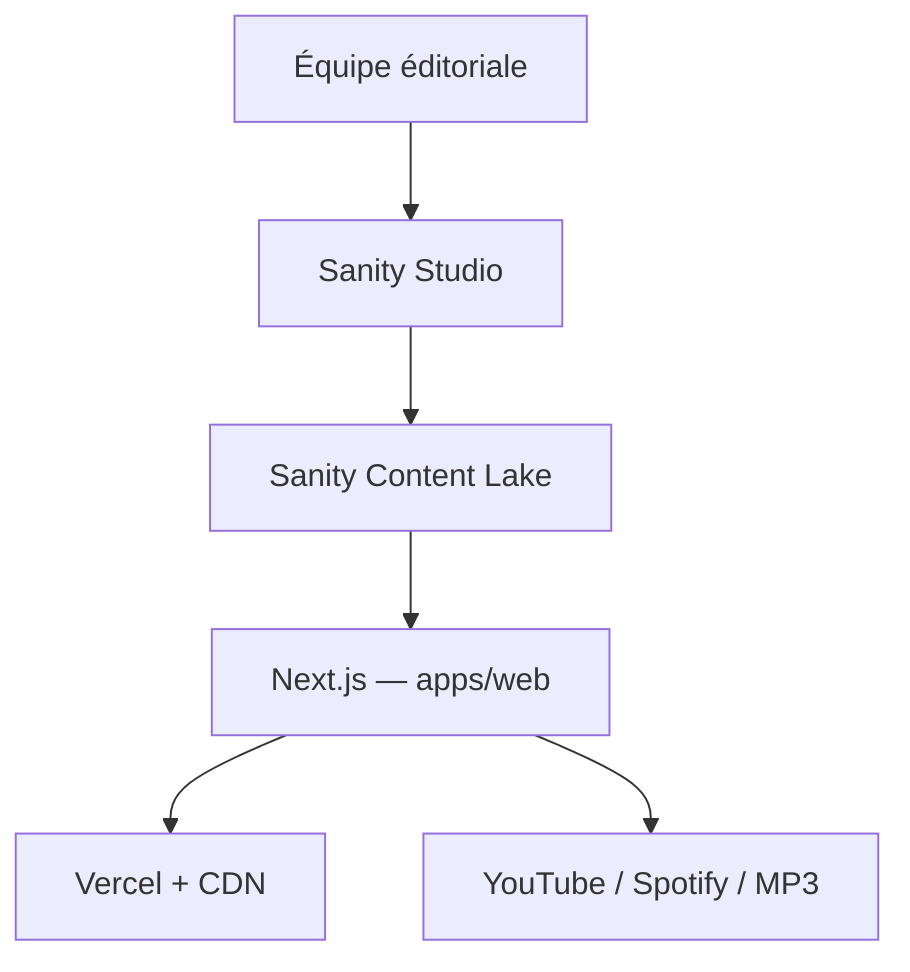
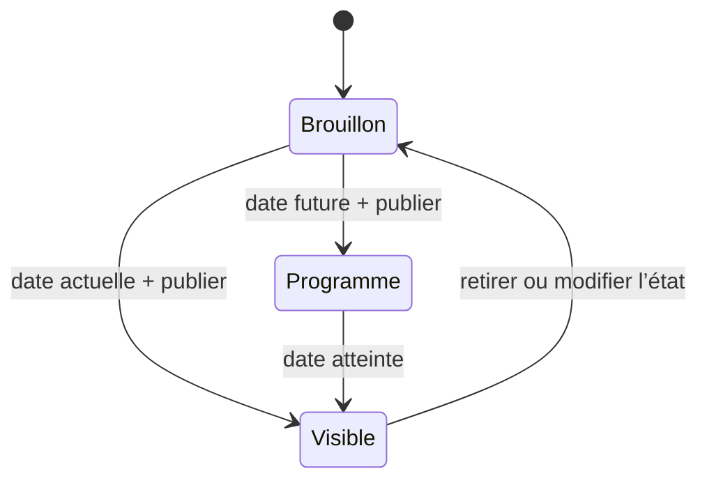

# Architecture cible de THE TALK

## 1. Décision

THE TALK évolue vers une plateforme éditoriale découplée : une application publique Next.js, un Sanity Studio comme back-office unique et des intégrations externes limitées à des responsabilités précises. Le site React/Vite actuel reste déployé pendant la transition afin de rendre la migration réversible.



## 2. Principes

- **Une source de vérité** : épisodes, articles, personnes, catégories et réglages vivent dans Sanity.
- **Frontend sans secret** : le site public lit uniquement le dataset publié ; aucune clé d’écriture n’est exposée au navigateur.
- **Migration progressive** : les requêtes comprennent les champs historiques (`date`, `mainImage`, `videoUrl`, `duration`) et leurs remplaçants modernes.
- **Publication prévisible** : le bouton Sanity rend le document public ; `publicationStatus` et `publishedAt` déterminent quand le site l’affiche.
- **Architecture par domaines** : épisodes et blog possèdent chacun leur couche de données, leurs types et leurs pages.
- **Expansion par preuve** : comptes, communauté, commerce ou IA ne reviennent qu’avec un besoin métier, des règles de modération et un responsable opérationnel.

## 3. Organisation du code

```text
apps/web/
  src/app/                 routes, metadata, robots et sitemap
  src/components/
    content/               cartes et rendu Portable Text
    layout/                en-tête et pied de page
    ui/                    primitives visuelles réutilisables
  src/features/
    episodes/              accès aux épisodes
    blog/                  accès aux articles
  src/lib/
    sanity/                client, requêtes, images et types
    format.ts              formatage localisé
    site.ts                configuration publique
    youtube.ts             normalisation testée des URLs
studio/
  schemaTypes/             modèles éditoriaux TypeScript actifs
  schemas/                 archive temporaire des anciens modèles
  structure.ts             navigation du back-office
docs/                      architecture et décisions
```

Cette structure évite un dossier global de “helpers” sans propriétaire. Lorsqu’un domaine grandira, ses composants, tests et opérations resteront proches de sa couche de données.

## 4. Modèle éditorial

| Type | Responsabilité | Champs structurants |
|---|---|---|
| `episode` | Conversation audio/vidéo | titre, slug, résumé, invité, saison/numéro, médias, état, date, SEO |
| `post` | Article du journal | titre, slug, chapô, auteur, catégories, Portable Text, état, date, SEO |
| `person` | Auteur ou invité réutilisable | nom, slug, fonction, portrait, bio |
| `category` | Taxonomie commune | nom, slug, description |
| `siteSettings` | Paramètres globaux | identité, URL canonique, réseaux et SEO par défaut |

### États de publication



Un document programmé doit être publié dans Sanity pour exister dans le dataset public. La requête du site le filtre jusqu’à `publishedAt <= now()`. Cette première version fournit une barrière de visibilité ; une automatisation Sanity dédiée pourra être ajoutée plus tard si l’équipe veut que l’état lui-même change à l’heure prévue.

## 5. Site public

Le rendu serveur de Next.js assure des métadonnées cohérentes, des URLs partageables et une base solide pour le référencement. Les pages de contenu sont dynamiques dans cette première étape afin que la programmation par date soit exacte sans dépendre d’un webhook. Après le déploiement, on pourra introduire une stratégie de cache avec revalidation déclenchée par Sanity.

Routes initiales :

| Route | Fonction |
|---|---|
| `/` | manifeste de marque, derniers épisodes et derniers articles |
| `/episodes` | catalogue des conversations |
| `/episodes/[slug]` | lecture YouTube, MP3 et liens plateforme |
| `/blog` | index éditorial |
| `/blog/[slug]` | article Portable Text |
| `/about` | positionnement de la marque |

Les listes vides affichent un état honnête : aucun faux contenu n’est livré lorsque Sanity ne contient rien de publié.

## 6. Back-office

Le Studio est volontairement plus simple que l’ancien produit : navigation centrée sur Épisodes, Journal, Personnes, Catégories et Paramètres. Les fonctions sociales, sondages, badges, boutique et résumés IA ne font pas partie du schéma actif.

Les garde-fous de saisie comprennent slugs obligatoires, limites éditoriales, texte alternatif sur les nouvelles images, choix explicite de l’état et champs SEO regroupés. Les champs historiques restent visibles pendant l’assainissement des données.

## 7. Déploiement et exploitation

La nouvelle application doit utiliser un projet Vercel distinct avec `apps/web` comme répertoire racine. Le domaine principal reste sur le site actuel pendant la recette.

Avant la bascule :

1. Configurer les variables Sanity et l’URL canonique dans Vercel.
2. Vérifier les épisodes/articles réels et les médias sur mobile et bureau.
3. Comparer les URLs indexées et préparer les redirections permanentes nécessaires.
4. Tester métadonnées, partage social, sitemap, robots, erreurs 404 et performances.
5. Faire une sauvegarde de la configuration de domaine, puis basculer avec une fenêtre de retour arrière.

Observabilité future : Vercel Analytics/Speed Insights pour les signaux web, Sentry seulement pour erreurs actionnables, et alertes de build/déploiement dans le canal d’exploitation choisi.

## 8. Plan d’implémentation

| Étape | Portée | Critère de sortie |
|---|---|---|
| **1 — Fondation** | Next.js/TypeScript, identité, routes principales, requêtes compatibles, Studio typé, workflow de publication, documentation | lint, types, tests et builds passent ; PR isolé sans impact production |
| **2 — Contenu réel** | audit et normalisation du dataset, personnes/catégories, SEO éditorial, images et médias, recette avec l’équipe | tous les contenus prioritaires sont complets et les URLs sont validées |
| **3 — Préproduction** | projet Vercel dédié, webhooks/revalidation, analytics, accessibilité, performance, redirections et tests E2E | recette signée, budgets web respectés et plan de retour arrière testé |
| **4 — Bascule** | domaine, surveillance, corrections courtes, gel puis retrait progressif du frontend historique | trafic stable, aucune URL critique perdue, erreurs sous le seuil convenu |
| **5 — Expansion** | newsletter robuste, recherche, transcription, séries/saisons ; communauté ou commerce seulement avec cadrage séparé | chaque capacité possède propriétaire, métrique, budget et politique d’exploitation |

## 9. Prochaines décisions

- Valider le vocabulaire éditorial français et la direction visuelle sur contenu réel.
- Choisir le responsable de publication et les règles de correction/retrait.
- Décider si la date programmée suffit ou si Sanity Scheduled Publishing est requis.
- Inventorier les URLs actuelles avant toute modification du domaine.
- Prioriser une seule expansion post-lancement à partir des données d’audience.

## 10. Contrôle éditorial automatisé

La deuxième étape ajoute un audit public en lecture seule (`npm run content:audit`) et une file « Qualité éditoriale » dans le Studio. Le rapport de référence est conservé dans [`content-audit.md`](content-audit.md). Le pipeline GitHub valide séparément l’audit, l’application moderne et le Studio afin que le projet Vercel historique ne soit plus le seul signal de qualité.

## 11. Socle de préproduction

La troisième étape commence par un cache Sanity à tags avec revalidation temporelle et webhook signé, les mesures Vercel Analytics/Speed Insights, des tests Playwright avec contrôle Axe et la première redirection permanente depuis les anciennes URLs d’épisode. La procédure, les budgets, l’inventaire des URLs et le plan de retour arrière sont détaillés dans [`preproduction.md`](preproduction.md).
